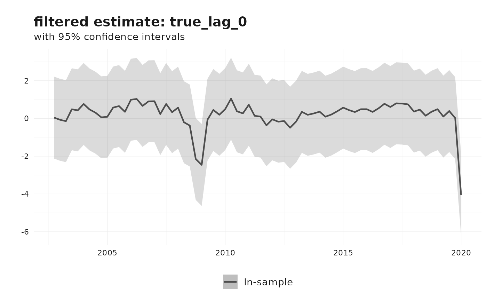
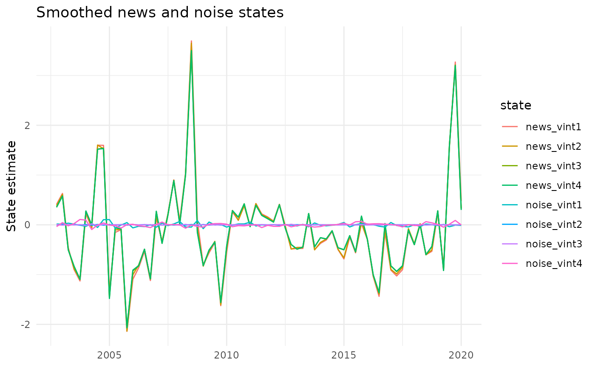

# Nowcasting revisions using the Jacobs-Van Norden model

This vignette describes the Jacobs-Van Norden (JVN) revision model as
implemented in
[`reviser::jvn_nowcast()`](https://docs.ropensci.org/reviser/reference/jvn_nowcast.md).
The presentation follows the same Durbin-Koopman state-space notation
used in the KK vignette: observations are linked to latent states
through \\Z\\, state dynamics through \\T\\, and innovations through
\\R\\, \\H\\, and \\Q\\ ([Durbin and Koopman
2012](#ref-durbinTimeSeriesAnalysis2012)).

The key idea of the JVN framework is that revision errors are not
treated as a single residual. Instead, they are decomposed into **news**
and **noise**. News corresponds to genuinely new information
incorporated by later releases, whereas noise corresponds to transitory
measurement error that is corrected in subsequent vintages ([Jacobs and
Van Norden 2011](#ref-jacobsModelingDataRevisions2011)).

## Revision decomposition

Let \\l\\ denote the number of vintages used in the model and let
\\y_t^{t+j}\\ be the estimate for reference period \\t\\ available in
vintage \\t+j\\. Stack the vintages into

\\ y_t = \begin{bmatrix} y_t^{t+1} \\ y_t^{t+2} \\ \vdots \\ y_t^{t+l}
\end{bmatrix}. \\

Let \\\tilde y_t\\ denote the latent “true” value and let \\\iota_l\\ be
an \\l \times 1\\ vector of ones. The JVN decomposition is

\\ y_t = \iota_l \tilde y_t + \nu_t + \zeta_t, \\

where \\\nu_t\\ is the news component and \\\zeta_t\\ is the noise
component.

- \\\nu_t\\ captures information that was unavailable when early
  releases were produced and is therefore rationally incorporated later.
- \\\zeta_t\\ captures transitory measurement error that is eventually
  revised away.

This decomposition is the main attraction of the JVN model: it separates
revisions that reflect learning about the economy from revisions that
reflect mistakes in earlier measurement.

## Durbin-Koopman state-space form

In the notation of Durbin and Koopman
([2012](#ref-durbinTimeSeriesAnalysis2012)), the generic state-space
model is

\\ y_t = Z \alpha_t + \varepsilon_t, \qquad \varepsilon_t \sim N(0, H),
\\

\\ \alpha\_{t+1} = T \alpha_t + R \eta_t, \qquad \eta_t \sim N(0, Q). \\

The current `reviser` implementation sets \\H = 0\\, so all uncertainty
enters through the transition equation. It also fixes \\Q = I\\ and
places the scale parameters directly in the shock-loading matrix \\R\\.

## The `reviser` implementation

[`jvn_nowcast()`](https://docs.ropensci.org/reviser/reference/jvn_nowcast.md)
implements a restricted but practical version of the JVN model. The
latent true value follows an AR(\\p\\) process, and the user may include
a news block, a noise block, or both. Optional spillovers are
implemented as diagonal persistence terms in the selected
measurement-error blocks.

When both news and noise are included, the state vector is

\\ \alpha_t = \begin{bmatrix} \tilde y_t \\ \tilde y\_{t-1} \\ \vdots \\
\tilde y\_{t-p+1} \\ \nu_t \\ \zeta_t \end{bmatrix}, \\

where \\\nu_t\\ and \\\zeta_t\\ are both \\l \times 1\\ vectors.

### Measurement equation

With \\l\\ vintages and an AR(\\p\\) latent process, the observation
matrix is

\\ Z = \begin{bmatrix} \iota_l & 0\_{l \times (p - 1)} & I_l & I_l
\end{bmatrix}, \\

so the observation equation is

\\ y_t = Z \alpha_t. \\

If only news or only noise is included, the corresponding block is
simply omitted from \\Z\\.

### Transition equation

The true-value block follows the companion-form AR(\\p\\) transition

\\ \Phi = \begin{bmatrix} \rho_1 & \rho_2 & \cdots & \rho_p \\ 1 & 0 &
\cdots & 0 \\ 0 & 1 & \ddots & \vdots \\ \vdots & \vdots & \ddots & 0
\end{bmatrix}. \\

The full transition matrix can therefore be written compactly as

\\ T = \begin{bmatrix} \Phi & 0 & 0 \\ 0 & T\_{\nu} & 0 \\ 0 & 0 &
T\_{\zeta} \end{bmatrix}, \\

where \\T\_{\nu}\\ and \\T\_{\zeta}\\ are diagonal spillover blocks when
spillovers are enabled and zero matrices otherwise.

### Shock-loading matrix

The implementation uses \\Q = I\\ and places the innovation standard
deviations inside \\R\\.

- The first structural shock loads on the latent true value with
  coefficient \\\sigma_e\\.
- The news shocks load negatively on the true value and positively on
  the news states in the upper-triangular pattern implied by
  `jvn_update_matrices()`. This enforces the idea that later vintages
  embed information unavailable to earlier vintages.
- The noise shocks load independently on the corresponding noise states
  with coefficients \\\sigma\_{\zeta,1}, \dots, \sigma\_{\zeta,l}\\.

This is the main implementation detail that differs from writing every
variance parameter inside \\Q\\: in `reviser`, \\Q\\ is fixed and \\R\\
carries the scale parameters.

## Nested JVN specifications

The function covers the empirically relevant subclasses discussed by
Jacobs and Van Norden ([2011](#ref-jacobsModelingDataRevisions2011)).

- `include_news = TRUE`, `include_noise = FALSE`: pure news model
- `include_news = FALSE`, `include_noise = TRUE`: pure noise model
- `include_news = TRUE`, `include_noise = TRUE`: combined news-noise
  model
- `include_spillovers = TRUE`: diagonal persistence in the selected
  measurement-error block(s)

Because these are nested specifications, information criteria are often
useful for comparing them, although standard boundary-value caveats
still apply.

## Example: Euro Area GDP revisions

We illustrate the workflow with four vintages of Euro Area GDP growth
from
[`reviser::gdp`](https://docs.ropensci.org/reviser/reference/gdp.md).

``` r

library(reviser)
library(dplyr)
library(tidyr)
library(tsbox)
library(ggplot2)

gdp_growth <- reviser::gdp |>
  tsbox::ts_pc() |>
  dplyr::filter(
    id == "EA",
    time >= min(pub_date),
    time <= as.Date("2020-01-01")
  ) |>
  tidyr::drop_na()

df <- get_nth_release(gdp_growth, n = 0:3)
df
#> # Vintages data (release format):
#> # Format:                         long
#> # Time periods:                   70
#> # Releases:                       4
#> # IDs:                            1
#>    time       pub_date      value id    release  
#>    <date>     <date>        <dbl> <chr> <chr>    
#>  1 2002-10-01 2003-01-01  0.169   EA    release_0
#>  2 2002-10-01 2003-04-01  0.124   EA    release_1
#>  3 2002-10-01 2003-07-01  0.105   EA    release_2
#>  4 2002-10-01 2003-10-01  0.0577  EA    release_3
#>  5 2003-01-01 2003-04-01  0.0149  EA    release_0
#>  6 2003-01-01 2003-07-01 -0.0133  EA    release_1
#>  7 2003-01-01 2003-10-01 -0.0558  EA    release_2
#>  8 2003-01-01 2004-01-01 -0.00601 EA    release_3
#>  9 2003-04-01 2003-07-01  0.00503 EA    release_0
#> 10 2003-04-01 2003-10-01 -0.0616  EA    release_1
#> # ℹ 270 more rows
```

The resulting data frame has one row per reference period and one column
per release, which is the format expected by
[`jvn_nowcast()`](https://docs.ropensci.org/reviser/reference/jvn_nowcast.md).

``` r

fit_jvn <- load_or_build_vignette_result(
  "nowcasting-revisions-jvn-fit.rds",
  function() {
    jvn_nowcast(
      df = df,
      e = 4,
      ar_order = 2,
      h = 0,
      include_news = TRUE,
      include_noise = TRUE,
      include_spillovers = TRUE,
      spillover_news = TRUE,
      spillover_noise = TRUE,
      method = "MLE",
      standardize = FALSE,
      solver_options = list(
        method = "L-BFGS-B",
        maxiter = 100,
        se_method = "hessian"
      )
    )
  }
)

summary(fit_jvn)
#> 
#> === Jacobs-Van Norden Model ===
#> 
#> Specification: news and noise 
#> AR order: 2 
#> Components: news = TRUE | noise = TRUE | spillovers = TRUE 
#> Estimation method: MLE 
#> Convergence: Failed 
#> Log-likelihood: 265.94 
#> AIC: -493.89 
#> BIC: -451.17 
#> 
#> Parameter Estimates:
#>     Parameter Estimate Std.Error
#>         rho_1    0.359     0.218
#>         rho_2    0.187     0.087
#>       sigma_e    0.485     0.107
#>    sigma_nu_1    0.001     0.030
#>    sigma_nu_2    0.048     0.004
#>    sigma_nu_3    0.007     0.044
#>    sigma_nu_4    1.105     1.143
#>  sigma_zeta_1    0.046     0.012
#>  sigma_zeta_2    0.003     0.005
#>  sigma_zeta_3    0.008     0.000
#>  sigma_zeta_4    0.039     0.007
#>        T_nu_1    0.156     0.075
#>        T_nu_2    0.114     0.080
#>        T_nu_3    0.101     0.085
#>        T_nu_4    0.093     0.089
#>      T_zeta_1   -0.176     0.324
#>      T_zeta_2   -0.900     0.000
#>      T_zeta_3   -0.630     0.071
#>      T_zeta_4    0.145     0.108
```

A fitted model is an S3 object inheriting from `revision_model`, so it
responds to the extractor generics you would use on any other model
object rather than requiring you to index into it.
[`coef()`](https://rdrr.io/r/stats/coef.html) returns the AR
coefficients, the latent-process innovation scale \\\sigma_e\\, the news
and noise innovation scales, and, when selected, the diagonal spillover
persistence parameters; [`vcov()`](https://rdrr.io/r/stats/vcov.html)
returns their covariance matrix, and
[`summary()`](https://rdrr.io/r/base/summary.html) shows estimates and
standard errors together.

``` r

coef(fit_jvn)
#>        rho_1        rho_2      sigma_e   sigma_nu_1   sigma_nu_2   sigma_nu_3 
#>  0.359044963  0.186864075  0.485450911  0.001000000  0.047553116  0.006548495 
#>   sigma_nu_4 sigma_zeta_1 sigma_zeta_2 sigma_zeta_3 sigma_zeta_4       T_nu_1 
#>  1.104710324  0.046230239  0.002978319  0.008193613  0.039059999  0.155911476 
#>       T_nu_2       T_nu_3       T_nu_4     T_zeta_1     T_zeta_2     T_zeta_3 
#>  0.113758109  0.100909331  0.093417008 -0.176370862 -0.900000000 -0.629661540 
#>     T_zeta_4 
#>  0.145007272
```

Fit criteria are reached the same way, and reproduce the values printed
by [`summary()`](https://rdrr.io/r/base/summary.html).

``` r

logLik(fit_jvn)
#> 'log Lik.' 265.9444 (df=19)
AIC(fit_jvn)
#> [1] -493.8887
BIC(fit_jvn)
#> [1] -451.1673
nobs(fit_jvn)
#> [1] 70
```

The [`states()`](https://docs.ropensci.org/reviser/reference/states.md)
accessor returns the estimated state paths, optionally restricted to
named states. The state named `true_lag_0` is the current latent true
value.

``` r

states(fit_jvn, filter = "smoothed", state = "true_lag_0") |>
  dplyr::slice_tail(n = 8)
#> # A tibble: 8 × 7
#>   time       state      estimate  lower   upper filter   sample   
#>   <date>     <chr>         <dbl>  <dbl>   <dbl> <chr>    <chr>    
#> 1 2018-04-01 true_lag_0    0.409 -0.936  1.75   smoothed in_sample
#> 2 2018-07-01 true_lag_0    0.742 -0.604  2.09   smoothed in_sample
#> 3 2018-10-01 true_lag_0    0.744 -0.601  2.09   smoothed in_sample
#> 4 2019-01-01 true_lag_0    0.165 -1.18   1.51   smoothed in_sample
#> 5 2019-04-01 true_lag_0    1.06  -0.284  2.41   smoothed in_sample
#> 6 2019-07-01 true_lag_0   -1.28  -2.63   0.0682 smoothed in_sample
#> 7 2019-10-01 true_lag_0   -3.15  -4.56  -1.74   smoothed in_sample
#> 8 2020-01-01 true_lag_0   -4.06  -6.23  -1.89   smoothed in_sample
```

The default plot method shows the filtered estimate of the latent true
value.

``` r

plot(fit_jvn)
```



We can also inspect the smoothed news and noise states directly.

``` r

states(fit_jvn, filter = "smoothed") |>
  dplyr::filter(grepl("news|noise", state)) |>
  ggplot(aes(x = time, y = estimate, color = state)) +
  geom_line() +
  labs(
    title = "Smoothed news and noise states",
    x = NULL,
    y = "State estimate"
  ) +
  theme_minimal()
```



## Other JVN specifications

Pure-news and pure-noise variants are obtained by switching off the
unwanted measurement-error block.

``` r

fit_news <- jvn_nowcast(
  df = df,
  e = 4,
  ar_order = 2,
  include_news = TRUE,
  include_noise = FALSE,
  include_spillovers = FALSE
)

fit_noise <- jvn_nowcast(
  df = df,
  e = 4,
  ar_order = 2,
  include_news = FALSE,
  include_noise = TRUE,
  include_spillovers = FALSE
)
```

If desired, the data can be approximately standardized before estimation
using `standardize = TRUE`. In that case, scaling metadata are returned
in the `scale` element of the fitted object.

Durbin, James, and Siem Jan Koopman. 2012. *Time Series Analysis by
State Space Methods: Second Edition*. Oxford University Press.
<https://doi.org/10.1093/acprof:oso/9780199641178.001.0001>.

Jacobs, Jan P. A. M., and Simon Van Norden. 2011. “Modeling Data
Revisions: Measurement Error and Dynamics of ‘True’ Values.” *Journal of
Econometrics* 161 (2): 101–9.
<https://doi.org/10.1016/j.jeconom.2010.04.010>.
